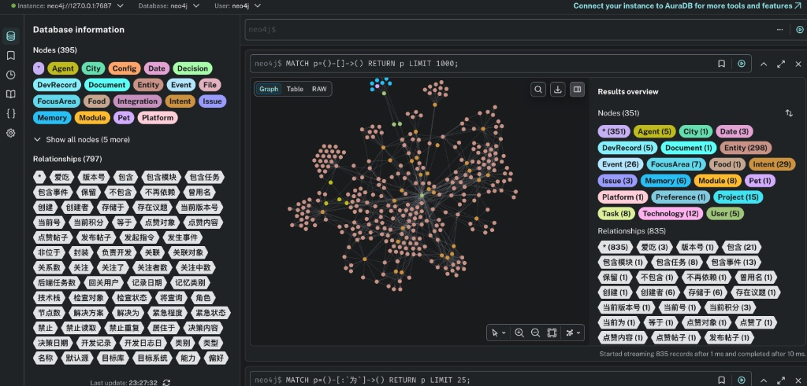
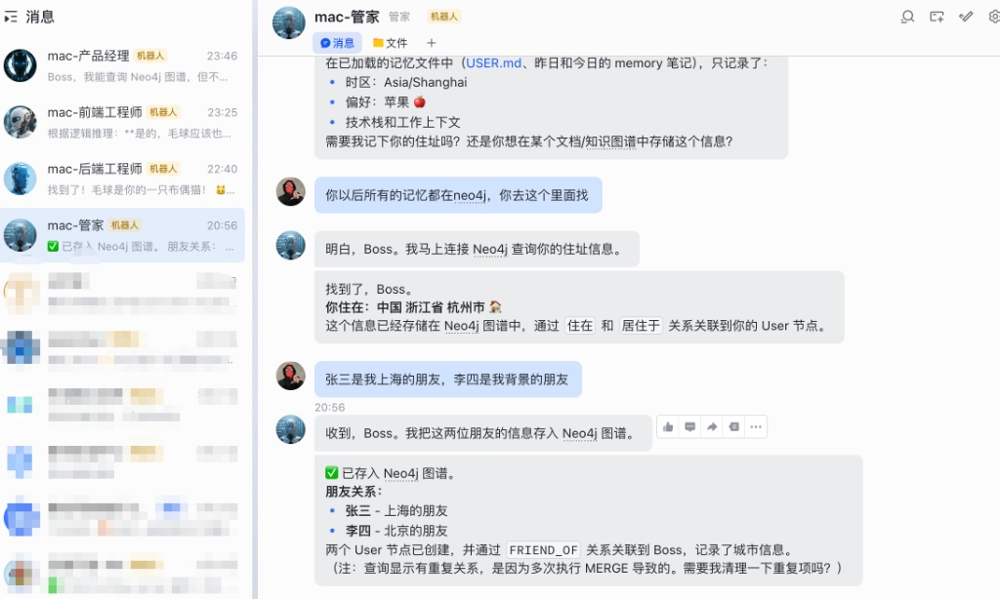
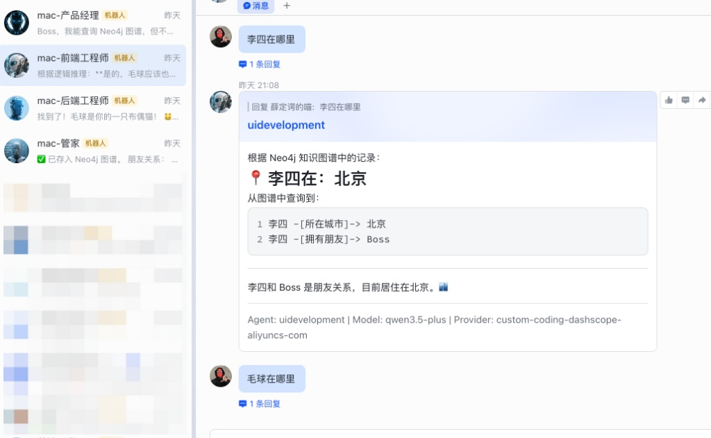
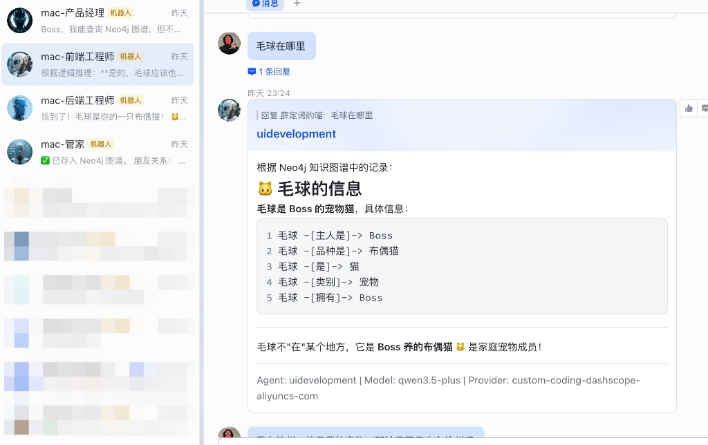

# OpenClaw 动态事实图谱记忆插件 (V4 - Entity Spontaneous Graph)

> [!NOTE]
> 本插件专为 OpenClaw 框架设计，提供了一个能随着对话“越聊越聪明”的企业级事实知识图谱（Fact Knowledge Graph）记忆底座。

---

## 📌 插件简介

在 AI 助手的长期运行中，传统的历史记录通常以“对话流”或“文本检索块”的形式存在。这导致大模型很难跨越时间建立立体的关联记忆（例如：“昨天 Boss 新买了什么车？”和“今天 Boss 把哪辆车送给了财务？”）。

`neo4j-memory` V4 版本是一场彻底的架构级跨越：
它摒弃了“流水账节点”模式，在每一次与任意 Agent 对话结束后，会自动将你的长难句，通过大语言模型提取出 **Subject-Predicate-Object (SPO) 事实三元组**（实体-关系-被动实体），并以“网络节点 + 动态动词连线”的形式永久固化在 Neo4j 图数据库中。每一次的对话，都是在为你的系统织一张真实的世界关系大网！

---
📸 核心功能演示
1. 自动构建：从对话到复杂图谱
当你在和 Agent 聊天时，插件会自动提取实体（Entity）和关系（Relationship）。不再是零散的文本，而是像人类大脑一样建立起错综复杂的连接。
🗨️ Agent 记忆现场,📊 同步生成的 Neo4j 图谱 (实测)

图 1：实时生成的 300+ 节点、800+ 关系的知识网络

图 2：Agent 记录 Boss 的居住地、朋友关系及偏好,
2. 精准检索：基于路径的逻辑推理 (GraphRAG)
由于数据以图的形式存储，Agent 可以进行“多跳搜索”。即使你问得很模糊，它也能顺着逻辑链条（如：李四 -> 居住于 -> 北京）给出精准答案。

🔍 精准定位居住地,🐱 理解复杂的从属关系,

即使信息繁杂，Agent 依然能秒回：李四在北京,Agent 能分清“毛球”是宠物而非地理位置

🔥 为什么选这个插件？
🧠 告别“鱼的记忆”： 向量数据库（Vector DB）只能按“长得像”来搜，而 Neo4j 能按“逻辑关系”来找。

🛠️ 零侵入集成： 保持 OpenClaw 核心纯净，作为 Plugin 放入即可使用。

⚡ 异步处理： 记忆提取在 agent_end 后触发，不影响对话响应速度。

📈 可视化管理： 你的 Agent 到底记住了什么？打开 Neo4j 浏览器一目了然。

🔄 自动去重 (MERGE)： 智能处理重复提及的信息，确保知识图谱干净、准确。

## 🛠 架构原理与细节剖析

> [!IMPORTANT]  
> 本系统之所以如此强壮（不崩塌、不死锁、不阻塞对话），完全得益于 **Node.js 网关拦截 + 无阻塞 Python 后台分离式萃取** 的“长短结合”微服务级架构。

### 核心处理流 (Mermaid Flowchart)

```mermaid
flowchart TD
    subgraph OpenClaw 消息处理网关 (Node.js)
        A([任意渠道消息汇入\nFeishu / WebUI]) --> B[全局 Hook: agent_end]
        B --> C{Metadata 清洗漏斗}
        C -->|识别数组对象| D[多模态内容抽取]
        C -->|正则剔除系统元数据| E[最后定位 message_id 截断]
        C -->|硬映射飞书 ID| F[Alias->Boss]
    end

    subgraph 后台事实提炼池 (Python Subprocess)
        E -->|参数透传 / 不 await 阻塞| G[openclaw-neo4j-hook.py]
        F --> G
        G -->|携带 Token / timeout=60s| H((阿里云 DashScope LLM))
        H -->|Zero-shot 抽取| I{{[SPO 事实 JSON 数组]}}
        
        I -->|Python Driver 连接池| J[(Neo4j 核心图谱)]
        J -->|安全转义反引号连线| K([MERGE 动态建立图谱神经元])
    end
```

### 为什么采用这套复杂的分体式架构？

1. **防大模型接口超时拖垮网关**：大模型的抽取时间存在极大的公网波动概率（可达几十秒）。原生 Node.js 的拦截直接 `await` 网络调用会导致连接池枯竭，甚至挂起整条 OpenClaw 对话响应链路。现在 Node 仅仅派发一个 `spawn` 子任务就闪退，确保业务对话即刻秒达！
2. **防 Feishu 数据下毒（脏数据截断）**：飞书适配器会注入如 `Conversation info` 或携带特殊换行符的高达 400字的幽灵 JSON。我们在 Node 层使用了绝对定位的 `.lastIndexOf('[message_id:')` 强行分离清洗，杜绝任何杂质影响图谱的实体质量。
3. **防 Neo4j Cypher 动词注入崩溃**：关系型数据库通常不接受非法字符或纯中文作为“关系 Label”。我们在 Python 里使用正则做了严格清洗，并用 反引号 (`` ` ``) 原生支持了任意中文动词的直接入库（如 `[:爱吃]` / `[:上级]`）。
4. **防多线程并发锁死数据库**：抛弃了 `message_sent` 与 `message_received` 的密集冗余写监控，锁定核心钩子 `agent_end`，有效遏制了 Neo4j `Row-level lock deadlock` 行级列锁超时。

---

## 🕸 图谱拓扑 (Schema V4)

V4 版本的图谱拓扑可以随心所欲生长。它原生包含两种结构：

### 1. 系统智能体拓扑 (Static Topology)
在插件首次挂载时，Neo4j 会被强行注入当前系统的 Agent 从属关系底座，用以保证后面的协作链路是可追溯的。
```cypher
(Entity:Agent {name: 'main'}) -[:上下级 {role: 'manager'}]-> (Entity:Agent {name: 'serverdevelopment'})
(Entity:Agent {name: 'main'}) -[:上下级 {role: 'manager'}]-> (Entity:Agent {name: 'productmanager'})
```

### 2. 自生长事实漫游图谱 (Spontaneous Triplet Graph)
以这句话为例： *"我(Boss)爱吃苹果！另外张三其实是负责后端的工程师。"*
它将不再存为一整坨孤立废话，而是会生长出极为精细的 4 个实体、3 根动态神经。且每个节点旁边都会挂带源文本作为 **消息溯源凭证 (Provenance)**。

```cypher
(Entity:User {name:'Boss'}) -[:爱吃]-> (Entity {name:'苹果'})
(Entity {name:'张三'}) -[:是]-> (Entity {name:'工程师'})
(Entity {name:'张三'}) -[:负责]-> (Entity {name:'后端'})

// 以及为了能知道这些事实是哪句话诞生的凭证连线：
(Intent {content:'我爱吃苹果...'}) -[:MENTIONS]-> (关联的所有Entity)
```

---

## 📦 开源版：如何安装与配置

> ⚠️ 本插件已高度可配置化，支持开箱即用，无需修改任何源代码！

### 第一步：环境准备 & 安装依赖库
确保宿主机具备 Python 环境与必要依赖库 (推荐 Python 3.8+)。将本插件克隆到 `~/.openclaw/extensions/neo4j-memory` 目录下。
打开终端执行：
```bash
cd ~/.openclaw/extensions/neo4j-memory
pip3 install -r requirements.txt
```

> [!TIP]
> **常见报错处理**：如果遇到 `ERROR: Could not find a version that satisfies the requirement neo4j (from versions: none)`，这**不是 Python 版本不支持**，而是网络源或 pip 太旧导致。
> 解决方法：
> 1. 确保使用的是真正的 Python 3 执行 (`python3 -V` 确认版本)。
> 2. 升级 pip：`python3 -m pip install --upgrade pip`
> 3. 使用国内镜像源重试：`pip3 install -r requirements.txt -i https://mirror.baidu.com/pypi/simple`

### 第二步：部署 Neo4j 数据库
本系统强依赖 Neo4j 数据库。您可以根据自身环境，选择 Docker 或者原生桌面版方式安装：

#### 方案 A：使用 Docker 部署（强烈推荐，一键完成）
如果您电脑上有 Docker，只需在终端执行这行代码即可：
```bash
docker run -d \
    --name openclaw-neo4j \
    -p 7474:7474 -p 7687:7687 \
    -e NEO4J_AUTH=neo4j/password \
    neo4j:latest
```
*启动后，数据库默认账号为 `neo4j`，密码为 `password`。*

#### 方案 B：无 Docker 物理机本地安装（Mac / Windows适用）
如果您不想折腾 Docker，可以使用官方小白图形化客户端：
1. 访问 [Neo4j Desktop 官网](https://neo4j.com/download/) 免费下载桌面端。
2. 安装并打开 Neo4j Desktop 后，点击左侧项目面板的 **"New" -> "Create Local DBMS"**。
3. 设置您的数据库密码（比如设为 `password`），数据库版本保持默认即可。
4. 点击新创建的数据库右侧的 **Start** 按钮将其启动。
*(同样默认监听本地 `7687` (bolt) 和 `7474` (浏览器测试界面) 端口)*

### 第三步：拷贝并配置 .env 环境变量（关键核心！）
为了保护您的隐私密钥，插件现在完全实现了密码与代码的脱钩。
在插件根目录下，复制我们为您准备的模板文件：

```bash
cp .env.example .env
```

然后打开 `.env` 文件，用你的真实信息替换它：
```env
# 你的 Neo4j 本地数据库链接与账号
NEO4J_URI=bolt://localhost:7687
NEO4J_USER=neo4j
NEO4J_PASSWORD=你的真实数据库密码

# 大语言模型密钥 (推荐千问 qwen3.5-plus，事实抽取出错率极低)
LLM_API_KEY=sk-你的阿里云百炼DashScope密钥
LLM_BASE_URL=https://coding.dashscope.aliyuncs.com/v1
LLM_MODEL=qwen3.5-plus
```

### 第四步：注册到 OpenClaw 并重启网关
要在系统中启用这个后台插件，你必须将其注册到 OpenClaw 的核心中。
1. 打开 OpenClaw 的总配置文件：`~/.openclaw/openclaw.json`。
2. 找到您的 `"plugins": { ... }` 节点所在位置，直接参考下方这张**完整的模板**修改即可（注意将 `installPath` 中的用户名换成您自己的）：

```json
"plugins": {
  "slots": {
    "memory": "neo4j-memory"  // 【关键】必须配置独占插槽，否则会和 OpenClaw 原生 memory_search 冲突！
  },
  "allow": ["neo4j-memory"],
  "entries": {
    "neo4j-memory": {
      "enabled": true
    }
  },
  "installs": {
    "neo4j-memory": {
      "source": "path",
      "spec": "file:./extensions/neo4j-memory",
      "installPath": "/Users/您的电脑用户名/.openclaw/extensions/neo4j-memory",
      "version": "1.0.0",
      "resolvedName": "@openclaw/neo4j-memory",
      "resolvedVersion": "1.0.0",
      "resolvedSpec": "file:./extensions/neo4j-memory"
    }
  }
}
```

3. 彻底杀掉并重启 OpenClaw 后台网关以挂载核心 RAG 拦截器：
```bash
# 重启网关进程
openclaw gateway
```
> **恭喜！至此已全部配置完成。**
> 试着在聊天窗口对你的 Agent 发送一句包含事实的断言（如：“记住，我最爱吃红富士苹果”），即可前往 `http://localhost:7474` 见证它在脑海中为你建立真正的图谱神经！

## 🛝 验收与查询技巧

> 一千行代码不如在 Neo4j Browser 中看见真相比对。

打开本地知识图查询终端 `http://localhost:7474`，执行这行万能探索语句：
```cypher
MATCH (s:Entity)-[r]->(o:Entity)
RETURN s, r, o
LIMIT 50
```
你将直接看到你随口在聊天软件说出来的生活琐事与业务流脉络，以美妙绝伦的星空图展示在你的屏幕上。遇到问题直接随时翻看 `tail -f /tmp/openclaw_neo4j_debug.log` 审查错误。
